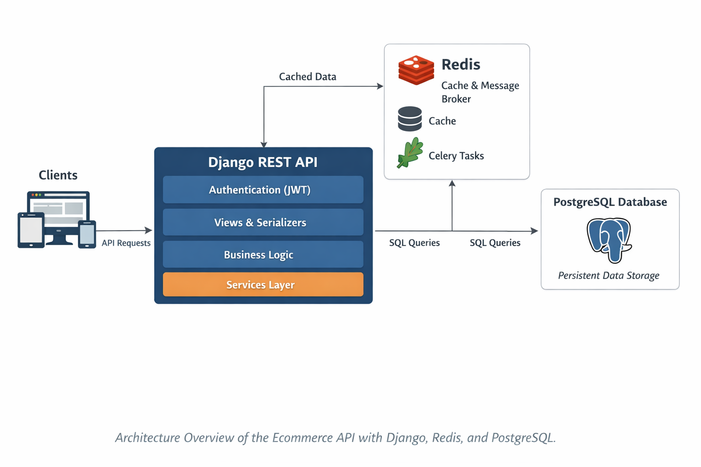

# 🛒 Ecommerce API – Django REST Backend

A complete backend for an e-commerce system built with Django and Django REST Framework, focused on clean architecture, automated testing, performance and production-ready practices.

This project is not just a CRUD. It is designed as a realistic, production-oriented API including JWT authentication, cart management, admin interface, independent apps, validation, automated testing, and performance testing.


## 🚀 Tech Stack

[](https://python.org)
[](https://www.postgresql.org/)
[](https://www.djangoproject.com/)
[](https://hub.docker.com)
[](https://docs.pytest.org/en/stable/)
[](https://www.linux.org/)
[](https://redis.io/)
[](https://gunicorn.org/)
[](https://docs.celeryq.dev/en/stable/)

## Architecture
---



<p align="center">
  <a href="#-key-technical-decisions">Key Technical Decisions</a> •
  <a href="#-measured-improvements">Measured improvements</a> •
  <a href="#-what-i-would-do-differently-in-production">What I Would Do Different?</a> •
  <a href="#-trade-offs-and-design-decisions">Trade-offs</a> •
  <a href="#-example-endpoints">Example Endpoints</a> •
  <a href="#-local-setup">Local Setup</a> •
  <a href="#-future-improvements">Future Improvements</a>
</p>

## 🧠 Key Technical Decisions

### 1. Django REST Framework

DRF was chosen for its maturity, ecosystem, and ability to quickly build robust APIs with built-in validation, serialization, and authentication.

---

### 2. Pytest over Django’s default test runner

I replaced Django’s default test runner with pytest because:

* Cleaner and more expressive syntax
* Reusable fixtures
* Parametrized testing
* Better scalability for larger test suites

This results in more readable and maintainable tests.

---

### 3. Fixtures + Factories (Model Bakery)

Reusable pytest fixtures are used for:

* API client
* authentication
* test data creation

Model Bakery allows generating test data with minimal boilerplate, keeping tests clean and focused.

---

### 4. Clear separation of responsibilities

The architecture follows a clean structure:

* Models → data layer
* Serializers → validation & transformation
* Views → orchestration
* URLs → routing

---

### 5. Permission system

Role-based access control is implemented:

* Regular users
* Admin/staff users

Restricted endpoints properly enforce permission rules.

---

### 6. Robust validation

The system validates cases such as:

* empty titles
* max length exceeded
* negative prices
* invalid foreign keys

All of these are covered by parametrized tests.

---

### 7. PostgreSQL instead of MySQL

PostgreSQL is used to simulate a real production environment:

* better concurrency
* stronger data integrity
* production-grade reliability

---

### 8. Redis caching

Heavy endpoints are cached using:

* django-redis
* cache_page decorator

This significantly reduces latency and database load.

---

### 9. Performance testing with Locust

Load testing was performed using Locust to:

* simulate concurrent users
* identify bottlenecks
* validate stability under load

---

### 10. Profiling & Monitoring (Django Silk)

The project integrates **Django Silk** for profiling and performance inspection:

* analyzing SQL queries
* measuring request/response time
* detecting N+1 queries
* inspecting API performance at a low level

Silk helps ensure the API remains efficient and scalable as it grows.

---

### 11. JWT Authentication

The API supports **JWT-based authentication** for secure and stateless client-server communication.

It provides:

* access and refresh tokens
* secure user authentication without server-side sessions
* token expiration and renewal
* easy integration with frontend clients and mobile apps

JWT was chosen to ensure scalability and decoupled authentication in distributed environments.

---

### 12. Admin Interface (Django Admin)

The project includes an administrative panel built with Django Admin to manage application data efficiently.

Key features:

* User management and authentication
* Full CRUD operations for core models (products, orders, customers, etc.)
* Search, filtering, and ordering for quick data inspection
* Role-based permissions (staff vs admin users)

Use cases:

* Inspect and validate data stored in the database
* Manually edit records during testing and development
* Monitor system data without interacting with the API directly

---

### 13. Email Delivery (SMTP)
The app uses Simple Mail Transfer Protocol for:

* Transactional emails (account actions, order notifications)
* Configured via environment variables
* Compatible with providers like Gmail, SendGrid, or Mailgun
* Falls back to Django console email backend in local development

---

### 14. Asynchronous Tasks (Celery)

- Integrated **Celery** with **Redis** as the message broker to handle background jobs.
- Offloads time-consuming tasks (sending emails, heavy computations) from the request/response cycle.
- Improves API responsiveness and scalability under load.
- Designed with idempotent tasks and retry strategies for reliability.

---

### 15. Logging (Python Logging)

- Configured Django logging using Python’s built-in `logging` module.
- Separate log levels for development and production (INFO, WARNING, ERROR).
- Console handler for local debugging and file/stream handlers for production environments.
- Structured logs for easier monitoring and debugging of issues.
- Prepared to integrate with external monitoring tools (e.g., Sentry, ELK stack).

### 16. Signals & Receivers

- Implemented Django signals to handle side effects in a decoupled way.
- Used receivers for events such as user creation, order placement, and data updates.
- Helps keep business logic clean and separated from models and views.
- Improves scalability by enabling event-driven extensions without modifying core logic.

### 17. Production readiness

The project is prepared for production with:

* Gunicorn as WSGI server
* environment variables
* decoupled configuration
* cloud deployment compatibility

---

## 📊 Measured Improvements

Using Silk and load testing, the following optimizations were achieved:

* Average response time for `GET /store/products/` reduced from **~450ms → ~90ms** after query optimization and caching
* Number of SQL queries per request reduced from **N+1 pattern (~30 queries)** to **constant ~3 queries** using `select_related` and `prefetch_related`
* Cache reduced repeated request latency from **~400ms → <10ms**
* System remained stable under **150+ concurrent users** during Locust testing with no data corruption in development server.

These optimizations demonstrate the system’s readiness for real-world traffic and scalability.

---

## 🚧 What I Would Do Differently in Production

If this project were running in a real production environment with real users and revenue at stake, I would make the following improvements:

* **Database hardening**

  * Add proper indexing strategy based on query patterns
  * Introduce read replicas for scaling reads
  * Use database transactions more aggressively for order/payment flows

* **Observability**

  * Add structured logging (JSON logs)
  * Integrate monitoring tools like Sentry and Prometheus/Grafana
  * Track request latency, error rate, and throughput

* **Testing depth**

  * Increase test coverage for edge cases (payment failures, race conditions, invalid states)
  * Add integration tests and smoke tests for deployments

* **CI/CD pipeline**

  * Add GitHub Actions pipeline with linting, tests, and build checks
  * Automatic deploy to staging before production

* **Infrastructure**

  * Containerize with Docker
  * Move from Heroku dynos to a more flexible environment (AWS ECS, Fly.io, or Kubernetes if scale requires it)

* **API versioning**

  * Introduce versioned endpoints (`/api/v1/`) to prevent breaking changes

---

Here is a short and clean section you can add right after the previous one:

---

## ⚖️ Trade-offs and Design Decisions

* **Monolithic architecture (for now)**

  * Chosen for simplicity, faster development, and easier deployment
  * Trade-off: less flexibility compared to microservices at large scale

* **Django REST Framework**

  * Rapid development and built-in features (auth, serializers, admin)
  * Trade-off: more abstraction, sometimes less control over performance-critical paths

* **JWT Authentication**

  * Stateless and scalable for APIs and mobile clients
  * Trade-off: token revocation and rotation require extra handling

* **Heroku deployment**

  * Very fast setup and low DevOps overhead
  * Trade-off: less infrastructure control and potentially higher cost at scale

* **PostgreSQL**

  * Reliable relational database with strong consistency
  * Trade-off: requires careful indexing and scaling strategy under heavy load

* **Minimal frontend (API-first approach)**

  * Focused on backend engineering and clean API design
  * Trade-off: no fully integrated user-facing interface yet

---

## 🔌 Example Endpoints

* GET     /store/products/
* GET     /store/products/{id}/
* POST    /store/carts/
* POST    /store/carts/{id}/cart-items/
* POST    /auth/jwt/create/
* POST    /auth/jwt/refresh/

## 🧪 Running Tests

The project includes a full automated test suite with pytest:

```bash
pytest
```

Covers:

* endpoint behavior
* permissions
* validations
* invalid input cases

---

## ⚡ Performance Testing

Run Locust:

```bash
locust -f locustfiles/browse_products.py
```

Then open:

```
http://localhost:8089
```

---

## 🧰 Local Setup

### 1. Clone repository

```bash
git clone https://github.com/Zunku/ecommerce-django.git
cd ecommerce-django
```

---

### 2. Create virtual environment

```bash
python -m venv .venv
source .venv/bin/activate     # macOS / Linux
.venv\Scripts\activate        # Windows
```

---

### 3. Install dependencies

```bash
pip install .
```

---

### 4. Run migrations

```bash
python manage.py migrate
```

### 5. Database settings
```bash
# dev.py
DATABASES = {
    'default':{yourdatabase}
}

```
---

### 6. Start server

```bash
python manage.py runserver 8000
```

---

## 🔐 Environment Variables

The project uses environment variables for secure configuration into production:

* SECRET_KEY
* DATABASE_URL
* DEBUG
* REDIS_URL
* EMAIL_HOST_USER

---

## ☁️ Deployment

The project is ready to be deployed to:

* Render
* Railway
* AWS
* Heroku

Includes configuration for:

* Gunicorn as the WSGI server
* static settings adapted for production
* PostgreSQL database provisioning
* environment-based settings

The application was deployed to Heroku as an initial cloud deployment to validate production readiness.

---

## 🔮 Future Improvements

- Payment integration (Stripe)
- Order history per user
- Inventory tracking with locking
- Rate limiting & abuse protection
- Async email queue with retries

---

## 📬 Contact

* GitHub: [github.com/Zunku](https://github.com/Zunku)
* Email: danielmendez1708@hotmail.com
* Linkedin: [linkedin.com/in/danielmd3/](https://linkedin.com/in/danielmd3/)

---

## ⭐ Final Note

This project reflects how I approach software development:

* understand the problem
* make deliberate technical decisions
* write maintainable code
* test what I build
* measure performance